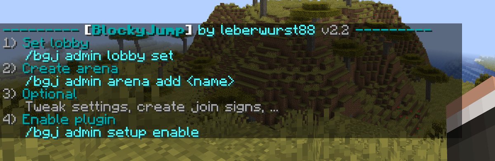

# Setup
This page contains instructions on how to setup the plugin. The process is really simple. Feel free to skip the sections that are not relevant for you.

?> If you haven't downloaded BlockyJump already, do so over on [SpigotMC]().

<!-- Quick start? -->

## Installation
To install the plugin, simply locate your /plugins folder and drop in the plugin's `.jar` file.  
Start your server and BlockyJump should be running and enabled.  
All the necessary files will be automatically created in the /plugins/BlockyGamesJump folder.

!> If your server is running, you might want to stop it first in order to install plugins as reloading might cause data leaks.

## Initial setup
When you join your server with basic admin permission `blockyjump.admin.basic` ([→ Permissions]()) or as an operator, you will be notified to perform the initial setup.

`/bgj admin setup`

This command will open the Initial Setup GUI which will help you to setup the plugin.  
First of all, you need to **set a lobby location**. Stand where you want your lobby to be and click the icon in the menu. Players can be teleported back to the lobby after a game. ([→ Lobby]())  
The second thing you want to do is **create an arena**. Simply click the icon and follow the instructions. ([→ Arena]())  
Optionally, you can now take a look at the following topics of this documentation.  
Lastly, you want to **enable the plugin**. This allows your players to play games and marks the setup as complete.

If you don't want to use the GUI, there are written instructions and the corresponding commands.

## config.yml

## database
By default, 

## messages.yml